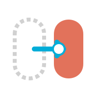

# molt — Universal Claw Agent Migration Tool

<p align="center">
  
</p>

<p align="center">
    Move your agents, groups, memory, skills, and config between NanoClaw, OpenClaw, ZeptoClaw, PicoClaw, and others — without starting over.
</p>

```
molt <source> <dest> --arch <target>
```

## The problem

Every claw architecture has its own format for groups, memory, config, and credentials. When you need to move — new machine, new architecture, scaling up or down — you're on your own. Existing tools only know about OpenClaw, and nothing knows how to read NanoClaw.

`molt` fixes that.

## How it works

`molt` exports your installation into a portable `.molt` bundle, then imports it into the target architecture using a driver for that arch. Drivers are standalone binaries that ship with each claw architecture. No registry, no network dependency, no trust issues.

```
molt export ~/nanoclaw-install --out ~/my-agents.molt
molt inspect ~/my-agents.molt          # preview before importing
molt import ~/my-agents.molt ~/new-install --arch zepto
```

Or combined:

```
molt ~/old-install ~/new-install --arch zepto
```

## What moves

| Item | Moves? | Notes |
|------|--------|-------|
| Group configs (name, trigger, JID) | ✓ | Normalized format |
| Per-group memory (CLAUDE.md, files) | ✓ | Verbatim |
| Global memory | ✓ | Verbatim |
| Conversation history | ✓ | Common schema + arch extensions |
| Scheduled tasks | ✓ | Normalized cron/interval |
| Skills | ✓ | User-installed only; built-ins excluded |
| Sessions (Claude session cache) | ⚠️ | Best-effort, with warning |
| Secrets / API keys | ✗ | `secrets-template.env` provided |
| Container images | ✗ | Rebuilt by target arch |

## Bundle format

A `.molt` file is a gzipped tar with a `manifest.json` and a predictable directory layout. Human-readable. Version-upgradeable via `molt upgrade`.

See [spec/BUNDLE.md](spec/BUNDLE.md) for the full format.

## Drivers

Each claw architecture ships a `molt-driver` binary that implements the driver interface. `molt` locates drivers via `$PATH` or `~/.molt/drivers/`.

```
molt-driver-nanoclaw   # ships with NanoClaw
molt-driver-zepto      # ships with ZeptoClaw
molt-driver-openclaw   # ships with OpenClaw
molt-driver-pico       # ships with PicoClaw
```

See [spec/DRIVER.md](spec/DRIVER.md) for the driver interface spec.

## Naming collisions

If a group slug already exists in the destination, molt aborts with a ready-to-run fix:

```
Error: agent slug collision — "main" already exists in dest.
Re-run with:
  molt import bundle.molt /dest --arch nanoclaw --rename main=main-imported
```

## Building

Requires Go 1.22+.

```bash
# Build and install molt + all drivers (default: ~/.local/bin/)
make install-all

# Override install location:
make install-all PREFIX=/usr/local   # needs sudo if not writable

# Or separately:
make install         # molt binary only → ~/.local/bin/molt
make install-drivers # all drivers    → ~/.local/bin/molt-driver-*

# Build without installing (outputs to ./build/)
make build
make build-drivers

# Cross-compile for darwin/linux (amd64 + arm64) → ./build/
make build-all

# Run all tests (molt + all drivers)
make test

# Run linters (requires golangci-lint: https://golangci-lint.run/welcome/install/)
make lint
```

The NanoClaw driver lives in `drivers/nanoclaw/` and has its own `go.mod`. Each driver is built independently; adding a new driver is as simple as creating a `drivers/<arch>/` directory with a `go.mod` and a binary that implements the [driver protocol](spec/DRIVER.md).

## Commands

```
molt export <source>            Export to bundle
  --out <file>                  Output path (default: <source-basename>.molt)
  --arch <name>                 Override source arch detection
  --exclude <slug>              Exclude group slug from bundle (repeatable)

molt import <bundle> <dest>     Import from bundle
  --arch <name>                 Target architecture (required)
  --rename <old>=<new>          Rename group slug on import (repeatable)
  --dry-run                     Show what would happen, make no changes

molt diff <bundle1> <bundle2>   Compare two .molt bundles
  --stat                        Show summary counts only, no per-item detail
  --path <slug>                 Scope diff to one group slug
  --format text|json            Output format (default: text)
  --patch                       Include unified diff for changed text files (≤512KB)
  Exit codes: 0=identical, 1=differences found, 2=error

molt inspect <bundle>           Show bundle contents without importing
molt upgrade <bundle>           Upgrade bundle to current format version
  --out <file>                  Output path (default: overwrites in place)

molt archs                      List installed drivers and their versions

molt sync init <destination>    Write .molt-sync.json with defaults
  --arch <name>                 Override arch detection
  --source <dir>                Source directory (default: cwd)
  --schedule <expr>             Cron expression or interval (default: "0 * * * *")
  --full-every <dur>            How often to write a full bundle (default: "7d")
  --force                       Overwrite existing config

molt sync start                 Launch the background daemon
molt sync stop                  Stop the daemon gracefully
molt sync status                Show daemon state, last run, next run, bundle count
molt sync run                   Trigger an immediate sync (foreground)
molt sync list                  List all saved bundles at the destination

molt restore                    Restore from a saved bundle chain
  --from <uri>                  Destination URI (default: from .molt-sync.json)
  --at <timestamp>              Restore to this point in time (ISO 8601; default: latest)
  --to <dir>                    Installation directory to restore into (default: cwd)
  --dry-run                     Print the bundle chain without importing

molt completion <bash|zsh|fish> Generate shell completion scripts
  --install                     Install to the appropriate path for the shell

molt <source> <dest>            Export + import in one step
  --arch <name>                 Target architecture (required)
  --rename <old>=<new>          Rename group slug
  --exclude <slug>              Exclude group slug (repeatable)
  --dry-run                     Dry run
```

## Backup and restore

`molt sync` exports your installation to a destination on a schedule. The first run is a full bundle; subsequent runs within `full_every` (default: weekly) are delta bundles containing only what changed.

```bash
# Set up and start
molt sync init file:///backups/nanoclaw --source ~/src/nanoclaw
molt sync run           # test a manual sync
molt sync start         # launch background daemon
molt sync status        # check daemon state

# Restore to latest
molt restore --from file:///backups/nanoclaw --to ~/src/nanoclaw

# Restore to a point in time
molt restore --from file:///backups/nanoclaw --at 2026-03-27T10:00:00Z --dry-run
```

Destinations: `file://` (local or network-mounted), `ssh://` (via rsync). S3 support planned for v1.0 polish.

## Status

NanoClaw driver complete (v0.1.0). ZeptoClaw, OpenClaw, and PicoClaw drivers planned for v0.2.0.

See [spec/ROADMAP.md](spec/ROADMAP.md) for the full roadmap.

Contributions welcome — especially drivers for architectures we haven't seen yet.

## Future

A driver registry (ClawHub-style) is on the roadmap for discovery and auto-install of drivers. The core tool will remain peer-to-peer; the registry is opt-in.
